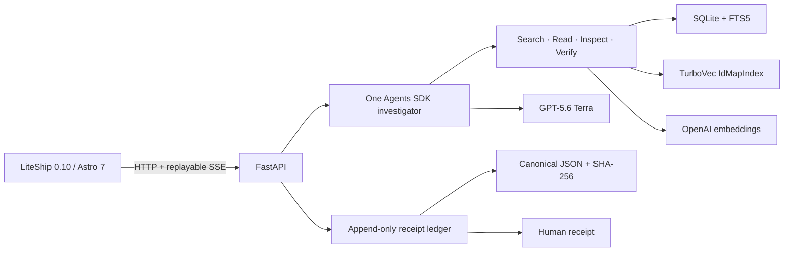

# Architecture

The corpus builder extracts only explicitly selected source pages, chunks without crossing page boundaries, embeds and normalizes text, writes SQLite and TurboVec into a temporary directory, validates them, and atomically publishes an immutable manifest version.
