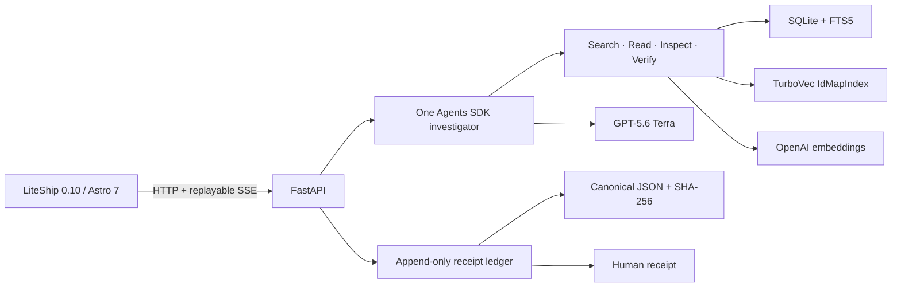

# Architecture

The corpus builder extracts only explicitly selected source pages, chunks without crossing page boundaries, embeds and normalizes text, and writes SQLite and TurboVec into a temporary directory. The manifest commits to both artifacts and canonical ordered chunk records; startup reconciles counts, source hashes, and the complete SQLite/TurboVec ID set before serving the version.

Runs belong to a server-generated browser session. One guarded lifecycle handles live and rehearsal execution, cancellation, timeout, failure, shutdown, and restart recovery. Live admission uses a `BEGIN IMMEDIATE` SQLite transaction to reserve conservative per-run token capacity across concurrent processes. Rolling-window commitment is calculated as unreserved in-window usage plus, for every active run, its in-window usage and remaining protected capacity (`reservation - all-time usage`); active reservations remain counted regardless of their creation time, without double-counting consumed tokens. Admissions remain reversible by run ID until the run row is persisted: shared-budget or persistence failures roll back model capacity and the exact browser/network attempt, while successful persisted runs retain the intended hourly charge. Before each model request, another immediate transaction expands that reservation for a byte-based input ceiling plus a provider-enforced output cap. Persisting the response usage and expanding the reservation to actual cumulative usage happen in one transaction. Terminal finalization releases the reservation after call usage is durable; if the intended terminal commit fails after sealing, the run is durably marked recoverable and SSE emits `run.interrupted` rather than the stale intended event. Startup reconciliation removes terminal and orphaned reservations and can recover a valid sealed receipt. Per-IP limits use the transport peer by default and accept `CF-Connecting-IP` only from explicitly configured trusted-proxy CIDRs whose edge configuration strips incoming copies. Terminal ledger events are withheld from SSE until the terminal envelope, independently stored receipt digest, and receipt path are durable.
