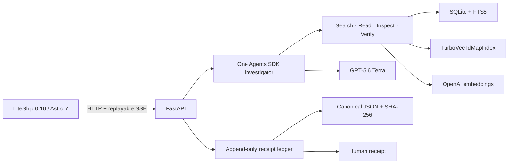

# Architecture

The corpus builder extracts only explicitly selected source pages, chunks without crossing page boundaries, embeds and normalizes text, and writes SQLite and TurboVec into a temporary directory. The manifest commits to both artifacts and canonical ordered chunk records; startup reconciles counts, source hashes, and the complete SQLite/TurboVec ID set before serving the version.

Runs belong to a server-generated browser session. One guarded lifecycle handles live and rehearsal execution, cancellation, timeout, failure, shutdown, and restart recovery. Terminal ledger events are withheld from SSE until the terminal envelope, independently stored receipt digest, and receipt path are durable.
